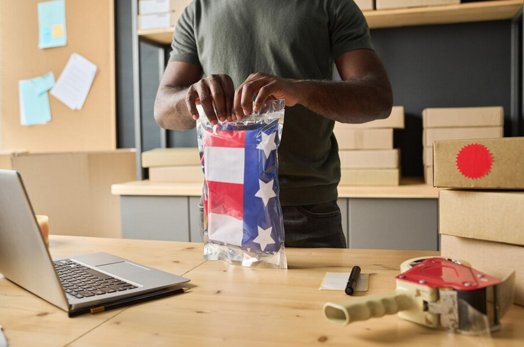

# Data Scientist

## Skills
Tensorflow, Keras, LangChain, LlamaIndex, PineCone, Jenkins, Hadoop, PySpark, Tableau, Snowflake, AWS SageMaker, Azure Data Lake, Azure Data Factory, Weviate, Docker, Kubernetes, Prompt Engineering, Azure Databricks, Flask, Django, DVC, MLFlow, Airflow, CircleCI, Regression, Classification, NLP, Clustering, Time Series, ANN, CNN, FastAPI.

## Education
Bachelor Of Science in Software Engineering - Makerere University (2025)

## Work Experience
**Bioinformatics Reasearch Scientist - Makerere University** 
- Harnessing Genome Wide Association studies to identify biomarkers linked to the early onset of Alzheimer's disease and construct predictive models for the detection of these biomarkers within gene sequences.

**Data Science Intern - iNeuron.ai** 
- Led the design and implementation of a scalable Sentiment Analysis Pipeline using Spark, HDFS, and AWS S3 to analyze customer reviews in real-time.
- Developed and maintained the pipeline, ensuring seamless integration with AWS S3 for data retrieval and storage in HDFS.
- Produced reports and insights based on sentiment analysis results, enabling data-driven decision-making to enhance customer satisfaction and business performance.

## Projects
**1. Product Rating Prediction**

Developed a predictive model that can anticipate whether a customer liked or disliked a product based on their purchase behavior. In many cases, customers do not provide feedback or reviews after purchasing a product, making it difficult for the platform to assess customer preferences accurately. After analyzing historical data on product purchases and customer interactions, the model predicts the rating a user would assign to a product after making a purchase. This prediction enables the e-commerce platform to recommend similar or related products to customers and make informed decisions about product offerings.

Technologies: CircleCI, Jenkins, MLflow, Snowflake, Machine Learning Classifiers

**2. Backorder Prediction**

Developed a predictive model for backorder prediction using machine learning technology in the domain of e-commerce. Leveraging historical data from inventories, supply chains, and sales, the model classifies products as either likely to go into backorder or not. By anticipating potential backorders, the model aids in streamlining planning processes across production, logistics, and transportation, thereby preventing unexpected strain on operations. 

Technologies: Jenkins, MLflow, Snowflake, AWS Glue, Redshift

**3. Mall Customer Segmentation**

The Customer Segmentation & Understanding project was created to meet the pressing need for businesses to comprehend and adapt to their consumers' different preferences. It uses unsupervised machine learning techniques. In today's highly competitive industry, this insight is critical for efficiently adapting products and marketing strategies. Using powerful machine learning algorithms, the initiative divided clients into meaningful groups based on common qualities and behaviors allowing for a better understanding of their interests and actions. It also led to enhanced marketing ROI.

Technologies: K-Means, DBScan, Jenkins, MLflow, Azure DevOps

**4. Automated KYC Document Processing & Account Creation**

Developed a novel system that uses object detection and OCR technologies to expedite the Know Your Customer (KYC) procedure for account opening in the banking industry. This solution has accelerated customer onboarding, reduced the risk of identity theft and fraudulent activities and lowered operational costs.

Ops Pipeline: DVC, MLflow, SageMaker, Azure Machine Learning Studio, Jenkins, CircleCI, TFX, Travis CI, Azure DevOps, CNN

**5. Insurance Claim Management**

To streamline the process of insurance claim administration, we created an automated system that uses deep learning, NLP, and computer vision techniques. The technology successfully matches submitted documents to their original format, extracts handwritten and digital text, and populates pertinent fields in claim forms, minimizing manual work and increasing efficiency.

Ops Pipeline: DVC, MLflow, SageMaker, Azure Machine Learning Studio, Jenkins, CircleCI, TFX, Travis CI, Azure DevOps

**6. Banking Bot**

I developed a bot leveraging Natural Language Processing (NLP) and deep learning techniques to address various banking-related issues and queries. This bot serves as a mobile application that provides comprehensive assistance to users regarding their banking needs. The key objectives of the bot include resolving queries related to account information, transaction details, security services, loan policies, and account status updates. Additionally, it monitors transaction activities in real-time to identify and alert users about suspicious or fraudulent activities, empowering them to take necessary precautions and report incidents promptly. By providing quick and accurate responses to users' banking queries, it reduced the need for human intervention, resulting in faster resolution of issues and improved customer satisfaction

Ops Pipeline: DVC, MLflow, SageMaker, Jenkins, CircleCI, RNN, NLP

## Certifications
- Certificate in Machine Learning & Artificial Intelligence - Refactory Academy
- Mathematics for Machine Learning - DeepLearning.AI

